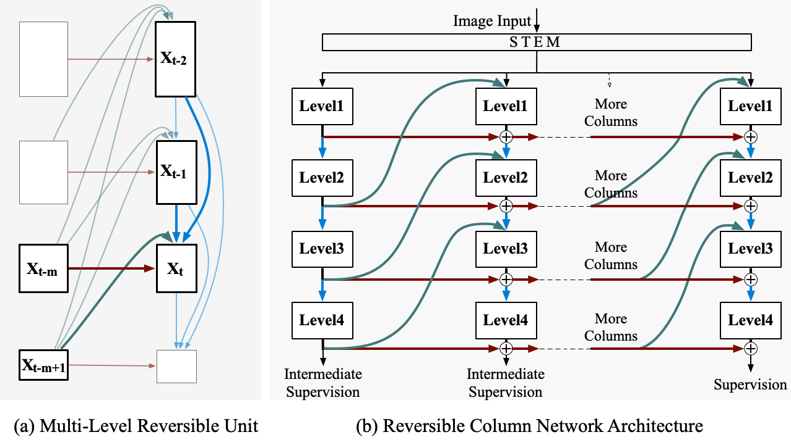

# Reversible Column Networks 
This repo is the official implementation of:

### [Reversible Column Networks](https://arxiv.org/abs/2212.11696)
[Yuxuan Cai](https://nightsnack.github.io), [Yizhuang Zhou](https://scholar.google.com/citations?user=VRSGDDEAAAAJ), [Qi Han](https://hanqer.github.io), Jianjian Sun, Xiangwen Kong, Jun Li, [Xiangyu Zhang](https://scholar.google.com/citations?user=yuB-cfoAAAAJ) \
[MEGVII Technology](https://en.megvii.com)\
International Conference on Learning Representations (ICLR) 2023\
[\[arxiv\]](https://arxiv.org/abs/2212.11696) 

### [RevColV2: Exploring Disentangled Representations in Masked Image Modeling](https://arxiv.org/abs/2309.01005)
[Qi Han](https://hanqer.github.io), [Yuxuan Cai](https://nightsnack.github.io), [Xiangyu Zhang](https://scholar.google.com/citations?user=yuB-cfoAAAAJ) \
[MEGVII Technology](https://en.megvii.com)\
[\[arxiv\]](https://arxiv.org/abs/2309.01005) 

## Updates
**9/06/2023***\
RevColv2 will be released soon!

**3/15/2023***\
RevCol Huge checkpoint for segmentation released! Add visualization tools.

**3/9/2023***\
Detection, Segmentation Code and Model Weights Released.

***2/10/2023***\
RevCol model weights released.

***1/21/2023***\
RevCol was accepted by ICLR 2023!

***12/23/2022***\
Initial commits: codes for ImageNet-1k and ImageNet-22k classification are released.


## To Do List


- [x] ImageNet-1K and 22k Training Code  
- [x] ImageNet-1K and 22k Model Weights
- [x] Cascade Mask R-CNN COCO Object Detection Code & Model Weights
- [x] ADE20k Semantic Segmentation Code & Model Weights


## Introduction
RevCol is composed of multiple copies of subnetworks, named columns respectively, between which multi-level reversible connections are employed. RevCol coud serves as a foundation model backbone for various tasks in computer vision including classification, detection and segmentation.

<p align="center">

</p>

## Main Results on ImageNet with Pre-trained Models

| name | pretrain | resolution | #params |FLOPs | acc@1 | pretrained model | finetuned model |
|:---------------------:| :---: | :---: | :---: | :---: | :---: | :---: | :---: |
| RevCol-T | ImageNet-1K | 224x224 | 30M | 4.5G | 82.2 | [baidu](https://pan.baidu.com/s/1iGsbdmFcDpwviCHaajeUnA?pwd=h4tj)/[github](https://github.com/megvii-research/RevCol/releases/download/checkpoint/revcol_tiny_1k.pth) | - |
| RevCol-S | ImageNet-1K | 224x224 | 60M | 9.0G | 83.5 | [baidu](https://pan.baidu.com/s/1hpHfdFrTZIPB5NTwqDMLag?pwd=mxuk)/[github](https://github.com/megvii-research/RevCol/releases/download/checkpoint/revcol_small_1k.pth) | - |
| RevCol-B | ImageNet-1K | 224x224 | 138M | 16.6G | 84.1 |  [baidu](https://pan.baidu.com/s/16XIJ1n8pXPD2cXwnFX6b9w?pwd=j6x9)/[github](https://github.com/megvii-research/RevCol/releases/download/checkpoint/revcol_base_1k.pth) |  - |
| RevCol-B<sup>\*</sup> | ImageNet-22K | 224x224 | 138M | 16.6G | 85.6 |[baidu](https://pan.baidu.com/s/1l8zOFifgC8fZtBpHK2ZQHg?pwd=rh58)/[github](https://github.com/megvii-research/RevCol/releases/download/checkpoint/revcol_base_22k.pth)| [baidu](https://pan.baidu.com/s/1HqhDXL6OIQdn1LeM2pewYQ?pwd=1bp3)/[github](https://github.com/megvii-research/RevCol/releases/download/checkpoint/revcol_base_22k_1kft_224.pth)|
| RevCol-B<sup>\*</sup> | ImageNet-22K | 384x384 | 138M | 48.9G | 86.7 |[baidu](https://pan.baidu.com/s/1l8zOFifgC8fZtBpHK2ZQHg?pwd=rh58)/[github](https://github.com/megvii-research/RevCol/releases/download/checkpoint/revcol_base_22k.pth)| [baidu](https://pan.baidu.com/s/18G0zAUygKgu58s2AjCBpsw?pwd=rv86)/[github](https://github.com/megvii-research/RevCol/releases/download/checkpoint/revcol_base_22k_1kft_384.pth)|
| RevCol-L<sup>\*</sup> | ImageNet-22K | 224x224 | 273M | 39G | 86.6 |[baidu](https://pan.baidu.com/s/1ueKqh3lFAAgC-vVU34ChYA?pwd=qv5m)/[github](https://github.com/megvii-research/RevCol/releases/download/checkpoint/revcol_large_22k.pth)| [baidu](https://pan.baidu.com/s/1CsWmcPcwieMzXE8pVmHh7w?pwd=qd9n)/[github](https://github.com/megvii-research/RevCol/releases/download/checkpoint/revcol_large_22k_1kft_224.pth)|
| RevCol-L<sup>\*</sup> | ImageNet-22K | 384x384 | 273M | 116G | 87.6 |[baidu](https://pan.baidu.com/s/1ueKqh3lFAAgC-vVU34ChYA?pwd=qv5m)/[github](https://github.com/megvii-research/RevCol/releases/download/checkpoint/revcol_large_22k.pth)| [baidu](https://pan.baidu.com/s/1VmCE3W3Xw6-Lo4rWrj9Xzg?pwd=x69r)/[github](https://github.com/megvii-research/RevCol/releases/download/checkpoint/revcol_large_22k_1kft_384.pth)|
| RevCol-H<sup>\*+</sup>  | Megdata-168M | pretrain 224 / finetune 640 | 2.1B | 2537 | 90.0 |[huggingface](https://huggingface.co/LarryTsai/RevCol/blob/main/revcol_models/classification/revcol_huge_megdata.pth)|[huggingface](https://huggingface.co/LarryTsai/RevCol/blob/main/revcol_models/classification/revcol_huge_megdata_in1k.pth)|

[+]: Note that we use a slightly different model on RevCol-H with one more branch from the bottom level to the top one. Later experiments prove that this connection is unnecessary, however, consider RevCol-H's training cost, we do not retrain it.
## Getting Started
Please refer to [INSTRUCTIONS.md](INSTRUCTIONS.md) for setting up, training and evaluation details.


## Acknowledgement
This repo was inspired by several open source projects. We are grateful for these excellent projects and list them as follows:
- [timm](https://github.com/rwightman/pytorch-image-models)
- [Swin Transformer](https://github.com/microsoft/Swin-Transformer)
- [ConvNeXt](https://github.com/facebookresearch/ConvNeXt)
- [beit](https://github.com/microsoft/unilm/tree/master/beit)

## License
RevCol is released under the [Apache 2.0 license](LICENSE).

## Contact Us
If you have any questions about this repo or the original paper, please contact Yuxuan at caiyuxuan@megvii.com.


## Citation
```
@inproceedings{cai2022reversible,
  title={Reversible Column Networks},
  author={Cai, Yuxuan and Zhou, Yizhuang and Han, Qi and Sun, Jianjian and Kong, Xiangwen and Li, Jun and Zhang, Xiangyu},
  booktitle={International Conference on Learning Representations},
  year={2023},
  url={https://openreview.net/forum?id=Oc2vlWU0jFY}
}
```
