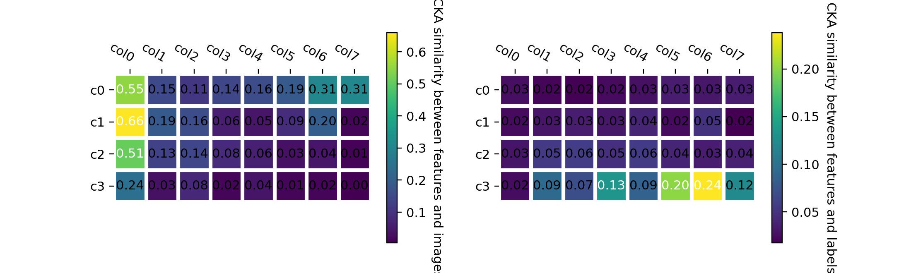
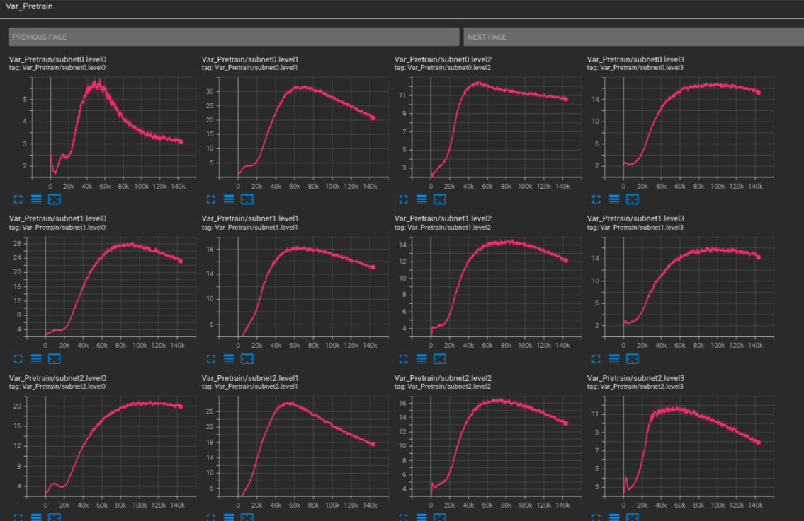

# Instructions for Visualizing Tools


## Checking CKA between features in each level and input/output

Please refer to `tools/visual.py`.

```shell
python3 tools/visual.py <checkpoint patyh> <output_dir>
```

For example, the cka visualization of a revcol small model:
```shell
python3 tools/visual.py /data/OnlineRevCol/revcol_small_1k.pth ./visual
```
<p align="center">

</p>


## Hooks monitoring the training variance of feature maps in each level

Create an instance of Training Hooks with tensorboard writer, then add hooks in training.

For example:

```python
import torch.distributed as dist
from tools.training_hooks import TrainingHooks

### create an instance of Training Hooks
if dist.get_rank() == 0:
    training_hooks = TrainingHooks(log_writer.writer)

## enumerate dataloader
for step, (samples, images,) in enumerate(data_loader):
## register hook
    if dist.get_rank() == 0 and step == 0:
        training_hooks.register_hook(model.module.blocks, "blocks")

## training
    outputs = model(samples)
    ............................................................

## remove hooks at the end of training and log to tensorboard
    if dist.get_rank() == 0 and step == len(data_loader)-1:
        training_hooks.remove_hook()
    if dist.get_rank() == 0:
        training_hooks.log_to_tb(epoch*len(data_loader)+step)

```
Tensorboard screenshot:

<p align="center">

</p>